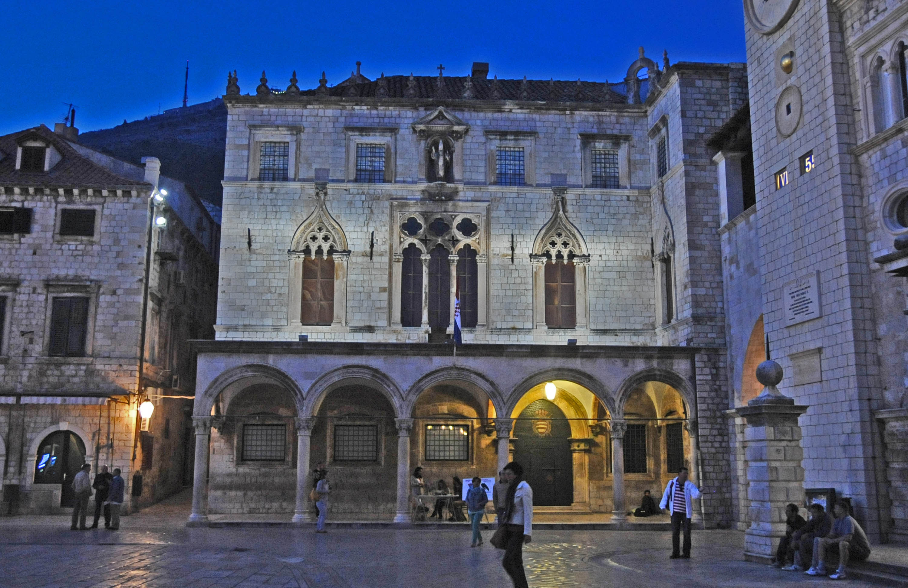
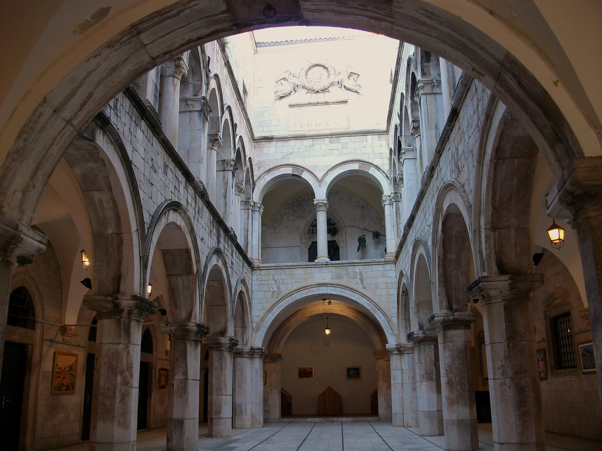
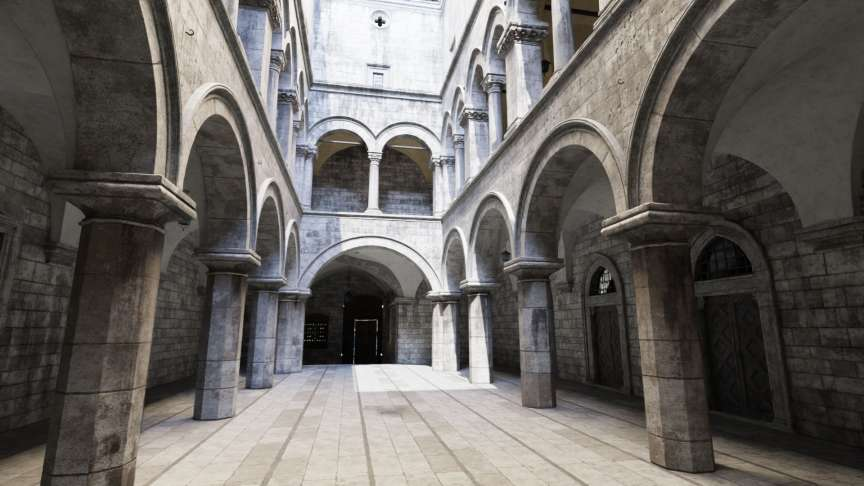
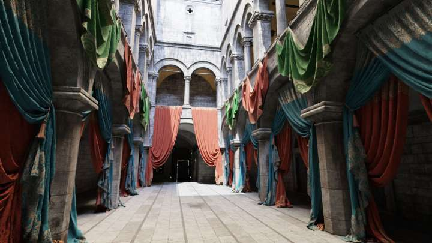
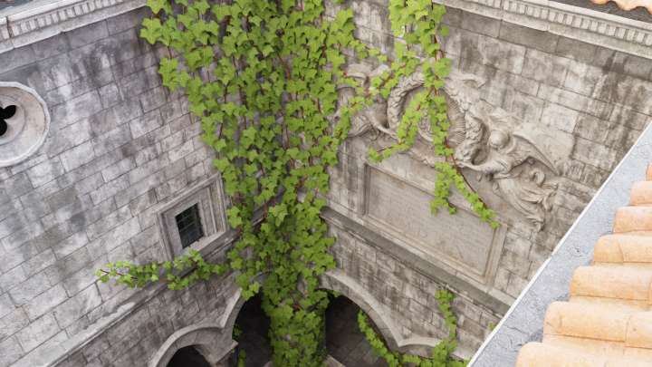
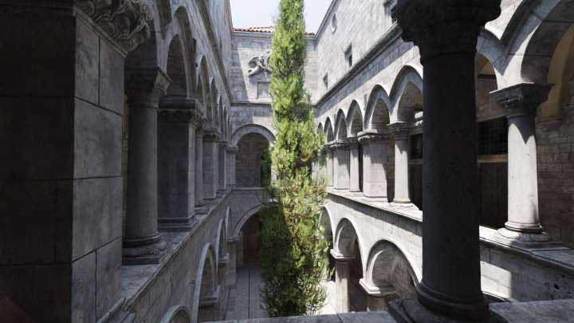
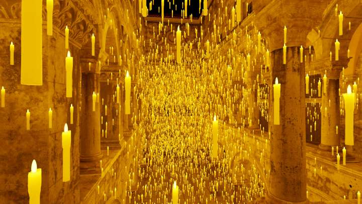
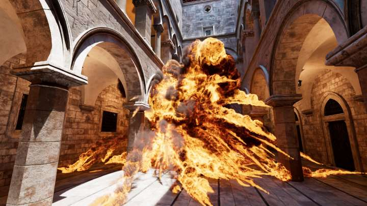
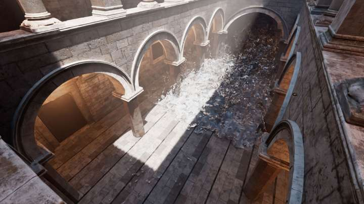

# Atividade 2 - Técnicas de Renderização

## Objetivos:

1. Consolidar os temas abordados no decorrer da disciplina, com ênfase nas técnicas de renderização foto-realistas baseadas em algoritmos de rasterização;
2. Explorar métodos de renderização baseados em mapeamento;
3. Reforçar o uso de diferentes tipos de fontes luz no controle do foto-realismo de cenas 3D;
4. Compreender as questões envolvidas na integração de objetos e seus materiais em cenários 3D.
 
## Motivação:

Na área de renderização diversos modelos de cenários virtuais são utilizados como *benchmark* de algoritmos. Um dos cenarios mais usados é o do Palacio de Sponza, localizado na cidade de Dubrovnik na Croacia [1]. Na Figura 1 podemos ver a vista externa e interna do palacio e no [vídeo](https://www.youtube.com/watch?v=eXR36vbX7xM) acompanhar um tour pelo átrio do palacio. 

  

*Figura 1 - Palacio de Sponza, Dubrovnik, Croacia: visão externa e interna* 

O modelo 3D do átrio do Palacio de Sponza foi criado por Marko Dabrovic no início de 2002 e melhorado em 2010 por Frank Meinl. Ao longo dos anos, esse modelo tornou-se uma das cenas 3D mais populares para testar algoritmos de iluminação global devido à sua estrutura arquitetônica específica, que é particularmente complexa para a propagação e iteração da luz. Artigos como [6] e [7], para citar apenas 2, utilizam o modelo Sponza como base para apresentação e analise dos resultados de seus algoritmos. 

No entanto, hoje em dia é considerado como um modelo simples, comparado a modelos mais desafiadores como o [*San Miguel*](https://casual-effects.com/g3d/data10/index.html#mesh29) [2] e o 
[*Amazon Lumberyard Bistro*](https://developer.nvidia.com/orca/amazon-lumberyard-bistro) [3]. 

Em 2022, o [grupo de pesquisa em GPU da Intel](https://www.intel.com/content/www/us/en/developer/topic-technology/graphics-research/overview.html) atualizou o modelo Sponza, incorporando materiais mais realistas com geometria de alta resolução e texturas 4K, fotogrametricamente compatíveis com o átrio do palacio de Sponza real [4]. A Figura 2 mostra o novo modelo base gerado. Além disso o bem como as adições de novos elementos ao cenário. 

 

   

    

*Figura 2 - Modelo Sponza atualizado pela Intel: primeira linha - modelo base; segunda linha - modelos com elementos adicionados (cortinas, trepadeira e cipreste); terceira linha - elementos mais complexos (10.000 velas, modelo de cavaleiro com animação, modelos volumétricos de explosão e modelo de fluido).* 

Vale ressaltar que apenas o modelo base contem a geometria do átrio do palácio de Sponza e suas texturas. 
Os demais modelos possuem apenas a geometria e texturas correspondentes aos elementos adicionados, 
que foram modelados de forma a "encaixar" com o modelo base. 

Tanto o modelo base quanto os demais modelos adicionais são fornecidos em diversos formatos, como [GLTF](https://www.khronos.org/Gltf), 
[FBX](https://code.blender.org/2013/08/fbx-binary-file-format-specification/) e 
[USD](https://openusd.org/release/index.html) para os modelos geométricos, e [VDB](https://www.openvdb.org/) (Volumetric Database File) 
para os modelos volumétricos.

## Atividade:

Nessa atividade voce deverá criar um cenário com renderização foto-realista baseado no modelo 3D Sponza da Intel adicionando alguns de seus 
complementos efeitos que o *framework Three.JS* [9] [10]fornece suporte. 

Como podemos ver na Figura 1, o átrio do Palácio de Sponza real possui diversas fontes de luz artificial ao longo da parte interna do arcos do 
átrio. Além disso recebe iluminação de uma abertura na parte superior do átrio que permite a passagem da luz natural do sol. 

Ainda na Figura 1 podemos notar que a parte externa do Palácio também possui iluminação artificial. Existe um ambiente ao redor do palácio, 
formado por outras construções, montanhas, céu, etc. 

Dessa forma, o cenário que voce vai construir deve ser composto:

1. Modelo base do átrio do Palacio de Sponza, desenvolvido pela Intel;
2. 1 dos modelos complementares do Palácio de Sponza da Intel;
3. Fontes de luz que iluminam o cenário interno do átrio;
    *A iluminação deve ser semelhante ao modelo real;
    * [Modelos glTF](https://threejs.org/manual/#en/load-gltf) armazenam as informações das fontes de luz do cenário, que precisam ser identificadas e ajustadas para produzir a iluminação correta do cenário.
4. Ambiente externo realista;
    * O ambiente externo pode ser representado por um [Mapeamento de Ambiente alinhado ao solo](https://threejs.org/examples/webgl_materials_envmaps_groundprojected.html). 
    * Estando o observador dentro do pátio interno deve ser possível ver o ambiente externo pela abertura no teto. 
5. Pelo menos 2 modelos geométricos incluidos por voce, que permitam testar 2 ou mais efeitos de iluminação [8] "avançados" do *framework Three.JS* [9] [10]. 

    Seguem alguns exemplos de efeitos interessantes:
    * [Objetos translucidos](https://threejs.org/examples/webgl_materials_cubemap_refraction.html)
    * [Objetos com verniz](https://threejs.org/examples/webgl_materials_physical_clearcoat.html)
    * [Espelhos](https://threejs.org/examples/webgl_mirror.html)
    * [Influência do ambiente na iluminação](https://threejs.org/examples/webgl_lightprobe_cubecamera.html)
    * [Fontes Extensas de Luz](https://threejs.org/examples/webgl_lights_rectarealight.html)
    * [Espelhamento Dinâmico do cenário](https://threejs.org/examples/webgl_materials_cubemap_dynamic.html)
    * [Transmissão da luz](https://threejs.org/examples/webgl_materials_physical_transmission.html)
    * [Água](https://threejs.org/examples/webgpu_ocean.html)
    * outros que voce ache interessante (mas que não sejam básicos).

    Esses modelos geométricos podem ser carregados do repositório *Assets*.

    Dependendo do tipo de efeito escolhido pode fazer sentido modificar a connfiguração da iluminação original do modelo Sponza. 
    Nesse caso voce pode fazer esse controle através da *GUI*.

6. Uma camera que permita caminhar pelo cenário de forma livre. 
    * O controle da camera deve ser feito via os controladores fornecidos pelo *Three.JS*.

7. Pontos de visualização fixos, que transportem o observador até esses pontos dentro do cenário. 
    * Utilize a *GUI* para seleção dos pontos de interesse.  

## Entrega e Critérios de Avaliação:

O trabalho será submetido individualmente através do repositório disponibilizado pelo professor, via *GitHub Classroom*, para essa atividade. A data de entrega estará definida na atividade do *Google/Github Classroom*.  

> **Não serão consideradas versões enviadas por e-mail, Google Classroom, Discord, ou outros meios.**

O trabalho será avaliado a partir dos seguintes critérios:

| Critério | Pontuação |
| :--- | :---: |
| 1. Relatório (README) | 0,5 |
| 2. Montagem do cenário (itens 1 e 2) | 1,0 |
| 3. Ajuste da iluminação do pátio (item 3) | 1,5 |
| 4. Percurso no cenário (item 6) | 1,0 |
| 5. Pontos de observação fixos (item 7) | 1,0 |
| 6. Realismo dos materiais (item 5) | 3,0 |
| 7. Ambiente externo (item 4) | 2,0 |
| 8. Criatividade na composição do cenário (extra) | 1,0 |

Espera-se no relatório uma breve descrição do que foi utilizado em termos de conceitos de Computação Gráfica e objetos do *Three.js*. 
Deve ser escrito utilizando a linguagem *markdown* e substituir o README original do repositório. 

Modelos externos ao diretório *Assets* que venham a ser utilizados devem ser incluídos dentro em diretório local dentro do seu repositorio. 

>**IMPORTANTE** => Os modelos Sponza e complementos não precisam ser colocados no seu repositório!! Considere que eles estarão localizados no diretório */Assets/Models/glTF/Sponza-Intel*, mantendo o nome dos diretórios originais gerados na descompactação dos arquivos .zip dos modelos do site da Intel.

## Penalidades:              

>  Trabalhos entregues fora do prazo será penalizados em 1,0 ponto por dia de atraso.
> 
>> **Em casos de plágio (total ou parcial) todos os envolvidos terão suas notas zeradas**. 

## Observações importantes:              

> Não presuma nada! Em caso de dúvida pergunte ao professor. 
> 
> Perguntas e dúvidas **gerais** devem ser postadas no canal *#atividades* do *Discord*. 
>
> **Dúvidas específicas** envolvendo seu código ou sua solução devem ser enviadas pelo *Discord* como mensagens privadas. 
>
> Mantenha sempre seu repositório atualizado para que o professor possa ter acesso ao código e ajuda-lo nas suas dúvidas.  

## Referências: 

[1]		Wikipedia, **Sponza Palace**, disponível em: https://en.wikipedia.org/wiki/Sponza_Palace

[2]     Frank Gennari, **San Miguel Scene**. 2017. Disponível em: https://3dworldgen.blogspot.com/2017/01/san-miguel-scene.html

[3]     Amazon Lumberyard, **Amazon Lumberyard Bistro, Open Research Content Archive (ORCA)**. Disponível em: https://developer.nvidia.com/orca/amazon-lumberyard-bistro 

[4]     Anton Kaplanyan, **Intel's Graphics Research Organization on a Mission to Deliver the Best Immersive Visuals**. Disponível em: https://www.intel.com/content/www/us/en/newsroom/opinion/intel-graphics-step-up-research.html

[5]		Intel, **GPU Research Samples**. Disponível em: https://www.intel.com/content/www/us/en/developer/topic-technology/graphics-research/samples.html

[6]		Smal, Niklas, and Maksim Aizenshtein. **Real-time global illumination with photon mapping**. Ray Tracing Gems: High-Quality and Real-Time Rendering with DXR and Other APIs (2019): 409-436.

[7]		Tatzgern, Wolfgang, Alexander Weinrauch, Pascal Stadlbauer, Joerg H. Mueller, Martin Winter and Markus Steinberger. **Radiance Caching with On-Surface Caches for Real-Time Global Illumination**. Proc. ACM Comput. Graph. Interact. Tech. 7 (2024): 38:1-38:17.

[8] 	MARSCHNER, Steve; SHIRLEY, Peter. "**Fundamentals of Computer Graphics**". 5th Edition CRC Press, 2021.

[9]		Dirksen, J., **Learn Three.JS: Program 3D animations and visualizations for the web with JavaScript and WebGL**. 4th Edition, Packt Publishing, 2023.

[10]	**Three.JS**. https://threejs.org/docs/index.html.
